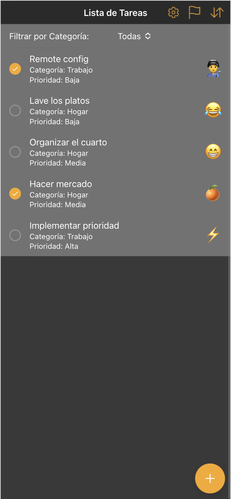
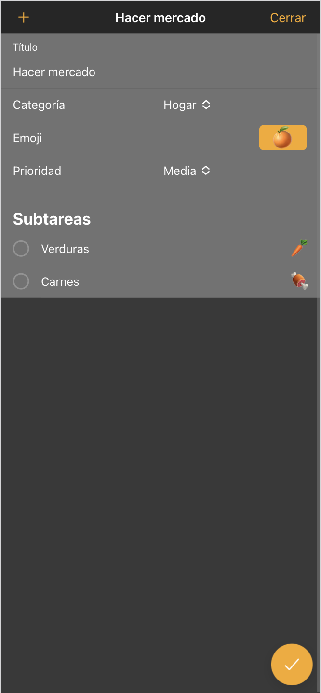

# Lista de Tareas - Aplicación Ionic

Esta aplicación de lista de tareas es una herramienta simple pero poderosa para ayudarte a organizar tus actividades diarias, gestionar tus proyectos y mejorar tu productividad. Desarrollada con Ionic, Angular, Capacitor y Firebase, esta aplicación ofrece una experiencia de usuario fluida e intuitiva, con características avanzadas que la diferencian de las aplicaciones de lista de tareas tradicionales.

## Capturas de la aplicación






## Características

*   **Gestión de Tareas:**
    *   Agregar nuevas tareas con título, categoría y prioridad.
    *   Marcar tareas como completadas.
    *   Eliminar tareas.
    *   Editar tareas existentes.
    *   **Subtareas:** Dividir tareas complejas en subtareas más manejables.

*   **Categorización:**
    *   Crear, editar y eliminar categorías personalizadas.
    *   Asignar una categoría a cada tarea.
    *   Filtrar tareas por categoría.

*   **Priorización:**
    *   Asignar un nivel de prioridad (Alta, Media, Baja) a cada tarea.
    *   Filtrar y ordenar tareas por prioridad.

*   **Personalización:**
    *   **Temas:** Elegir entre varios temas de color, incluyendo un modo oscuro que se adapta automáticamente a la configuración del sistema.

*   **Integración con Firebase:**
    *   **Remote Config:** Implementación de un feature flag (`edit_task`) para activar o desactivar la edición de tareas de forma remota y (`delete_task`) para activar o desactivar la eliminación de tareas de forma remota.

*   **Optimización de Rendimiento:**
    *   **Lazy Loading:** Los módulos se cargan solo cuando son necesarios, mejorando el tiempo de carga inicial.
    *   **Change Detection:** Estrategia `OnPush` para optimizar la detección de cambios y mejorar el rendimiento.

*   **Interfaz de Usuario Intuitiva:**
    *   Diseño limpio y moderno.
    *   Soporte para modo oscuro.

## Requisitos Previos

*   Node.js y npm
*   Ionic CLI
*   Angular CLI
*   Android Studio (para ejecutar en Android)
*   Xcode (para ejecutar en iOS)
*   Cuenta de Firebase (para Remote Config)

## Instalación

1. Clona el repositorio:

    ```bash
    git clone https://github.com/andycr95/todo-list-app
    ```

2. Instala las dependencias:

    ```bash
    cd todo-list-app
    npm install
    ```

3. Configura Firebase:
    *   Crea un proyecto en la consola de Firebase ([https://console.firebase.google.com/](https://console.firebase.google.com/)).
    *   Agrega una aplicación web a tu proyecto.
    *   Copia la configuración de Firebase en `src/environments/environment.ts` y `src/environments/environment.prod.ts`.
    *   En Firebase, ve a la sección "Remote Config" y crea un parámetro llamado `edit_task` de tipo `Boolean` con valor predeterminado `false` y otro llamado `delete_task` de tipo `Boolean` con valor predeterminado `false`.
    *   Publica los cambios en Remote Config.

## Ejecución de la Aplicación

*   **En el navegador:**

    ```bash
    ionic serve
    ```

*   **En un dispositivo Android:**

    1. Construye la aplicación web:

        ```bash
        ionic build --prod
        ```

    2. Sincroniza con el proyecto nativo:

        ```bash
        npx cap sync
        ```

    3. Abre el proyecto en Android Studio:

        ```bash
        npx cap open android
        ```

    4. Conecta tu dispositivo Android y habilita la depuración USB.
    5. Selecciona tu dispositivo en Android Studio y haz clic en "Run".

    *   Para Live Reload:

        ```bash
        ionic capacitor run android -l --external
        ```

*   **En un dispositivo iOS (requiere una Mac con Xcode):**

    1. Construye la aplicación web:

        ```bash
        ionic build --prod
        ```

    2. Sincroniza con el proyecto nativo:

        ```bash
        npx cap sync
        ```

    3. Abre el proyecto en Xcode:

        ```bash
        npx cap open ios
        ```

    4. Configura tu equipo de desarrollo en Xcode.
    5. Conecta tu dispositivo iOS.
    6. Selecciona tu dispositivo en Xcode y haz clic en "Run".

    *   Para Live Reload:

        ```bash
        ionic capacitor run ios -l --external
        ```

## Uso de Remote Config

La aplicación utiliza Firebase Remote Config para controlar la visibilidad de una funcionalidad especial. Puedes activar o desactivar esta funcionalidad desde la consola de Firebase:

1. Ve a tu proyecto en la consola de Firebase.
2. En la sección "Interactúa", selecciona "Remote Config".
3. Busca el parámetro `edit_task` o `delete_task`.
4. Cambia el valor a `true` para activar la funcionalidad o `false` para desactivarla.
5. Haz clic en "Publicar cambios".

La próxima vez que la aplicación se inicie (o se actualice la configuración remota), la funcionalidad especial se activará o desactivará según el valor del parámetro. La funcionalidad especial se encuentra en la pagina principal, la cual muestra un botón con un icono de estrella.

## Tecnologías Utilizadas

*   Ionic Framework
*   Angular
*   Capacitor
*   Firebase (Remote Config)
*   HTML, CSS, TypeScript
